# MINI - INSTA

Mini - insta is a website wherein users can upload and store images and share them as well with other users . Also the user is provided with the option to include hashtag with the uploaded image so that the other's user can find images based on the hashtags . Following are the feature that are provided in the project .......
  

## 1. Authentication
 

### Sign Up page

New users will land on sign up page where they can create new account by giving their username , name , email and password . All these details are stored in the firebase database . After that , the user will be redirect to the home page .   
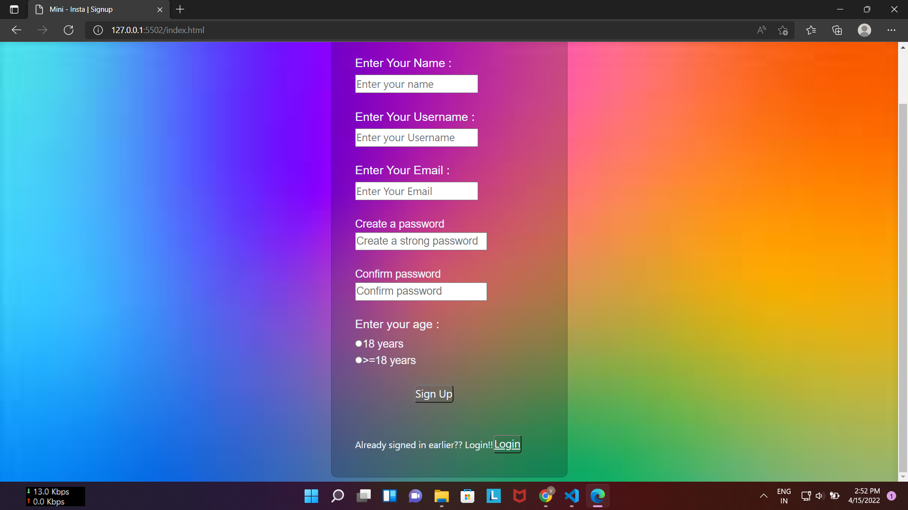
  
### Login page
Existing users can log into the account by giving username , email and password . If all the three details are correct , then the user will be redirect to the home page . If the user forgot the password , he/she can request a password reset mail to his registered email . If any error occur , user will be shown that error on the page itself ..
  
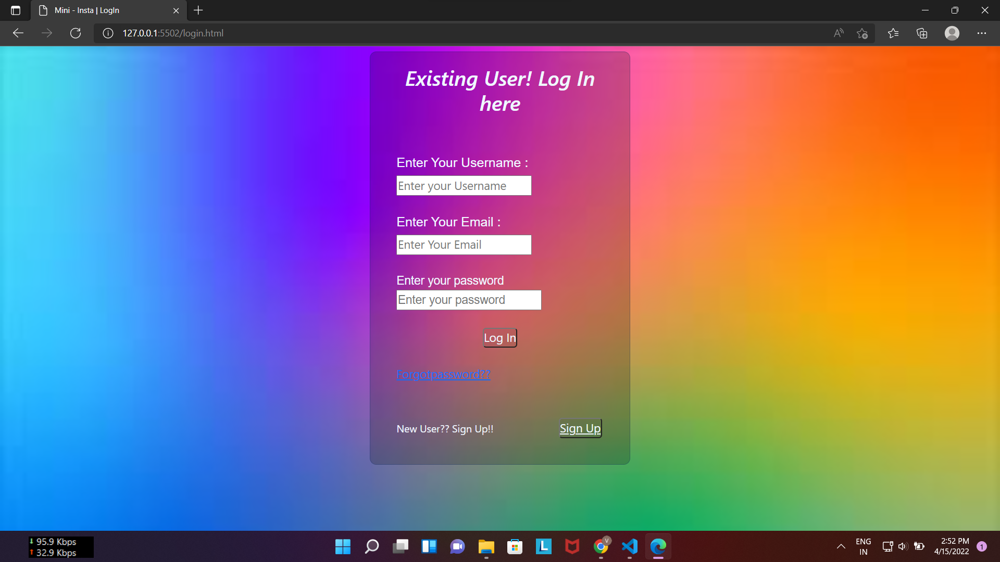
   

## 2. Home page 

On home page , the user will be provided with the option to navigate to the different section of the website . The following pages to jump upon are provided . 
 
* Personal Photo Collection page
* #Search image by hashtag 
* Shared with me 
* Search your friend by user name

 
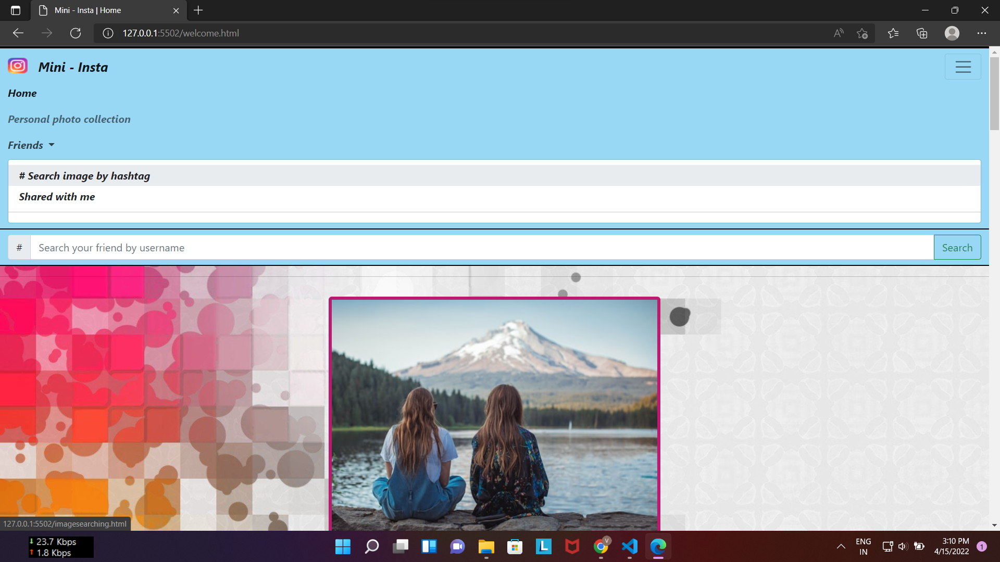
  
The Home is designed with default 5 -10 images which changes every time the user refreshes the page . This is done which " Unsplash API " . At the last of the page a logout button is also provided from where the user can log out of the account . If the user is following some other user , then that user's uploaded photos arrive at the top of the home page As shown below. The user is following a another user named #vibhanshushrm so it's all uploaded images will be shown on this user's home page ........
  
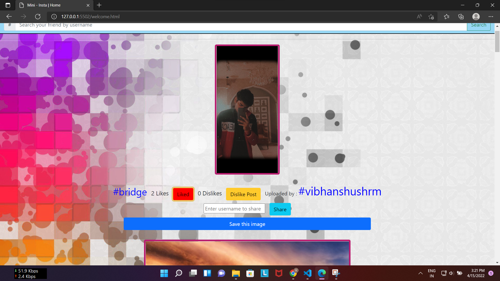
  
<h2>3. Options below every image</h2>
Every image is given with the following options :-
  
<ul>
   <li><h3>Like / Dislike Image  </h3> One user can like or dislike by the buttons provided .  </li>
   <li><h3>Sharing  :</h3> User can use image with any of the user just by typing the username and clicking share button . The image will be shared with the corresponding user. </li>
   <li><h3> Save the image  :</h3> User can save the image into his personal photo collection page by clicking "save the image" .  </li>
   <li><h3>Hashtag :</h3> '#' is present for every image  in the starting of the image's description  </li>
</ul>
  
<h2>4. Search user by username</h2> 
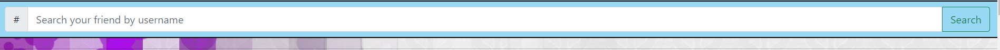
  
User can search any friend by writing his username and clicking search button . Error will be shown if no such username exists .If username exits , then the user will be directed to the profile page of entered username .

  
<h2>5. Other's profile :</h2>
 

  
After Searching the username of your's friend , You will be redirect to your's friend's profile page . Here you can see his uploaded images and save images . From here , you can follow and unfollow the user . 
If you follow the user , then his uploaded images wil be shown at your's homw page .
  
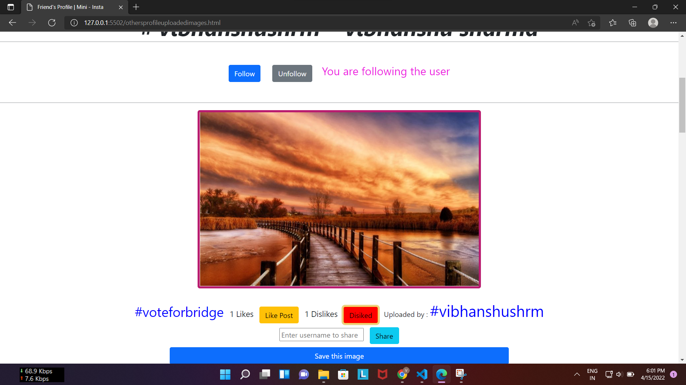
  
Share , Like , Dislike , Save image options are also provided on this page as well . All the changes in the above options are synchonized between all the pages .  
You can also view the user's saved posts by clicking on the Saved Images button.
  
<h2>6. Personal Photo Collection Page</h2>
 
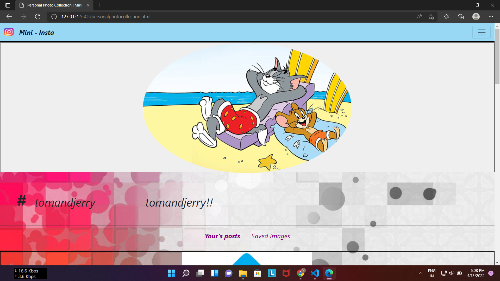
  
On personal photo collection page , user can view his uploaded images and saved images as the links given . User can also update the profile photo by going to navbar/friends/update profile photo .
  
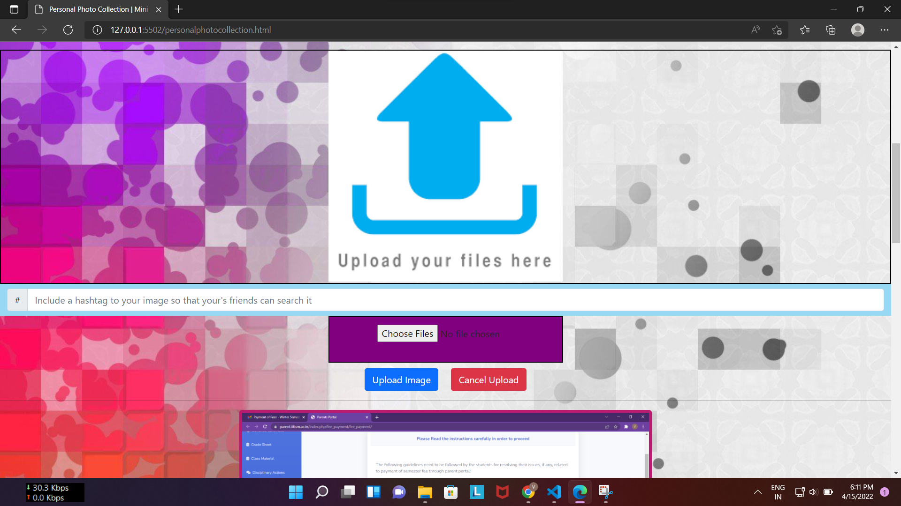
 
You can select image from the option given , then preview the image , then upload the image . File will be uploaded to the firebase storage . All the uploaded images will be shown under the uploaded images section . And all the saved posts will be under saved images .
  
<h2>7. #Search image by hashtags : </h2>
 
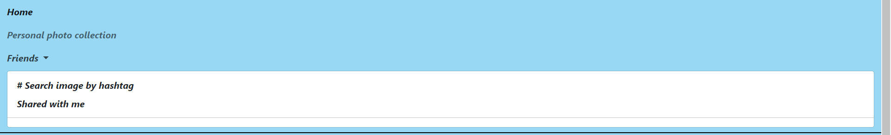
  
On the home page , the user is provided with the option to search image with the help of the hashtag . On clicking the option, the user will be redirect to a page where the user can search on the basis of hashtags . All the images corresponding to the hashtag will be diplayed . All the options like dislike , share , save are present here also . 
  
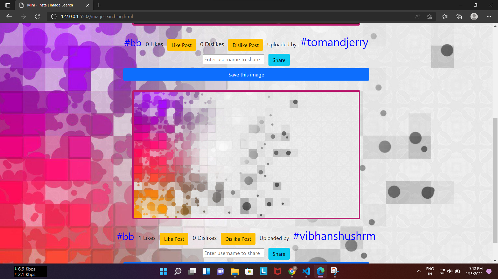
  
The above image shows the result of searching #bb in the search bar of "searching image by hashtag" . All options are provided and are synchronized to the firebase database. 
  
<h2>8. Shared with me </h2>
 
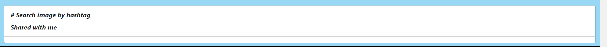
  
On the Home nav bar , the  user is provided with the option to see what the other users have shared with him .On clicking the option , the user will be re-direct to the page : -
  
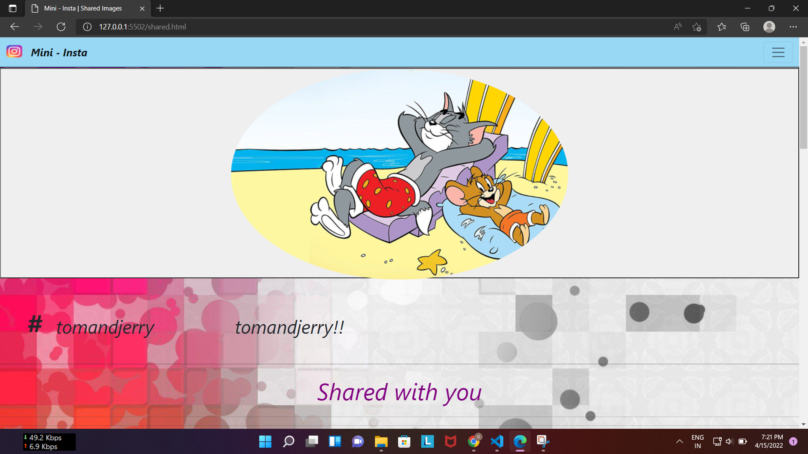
  
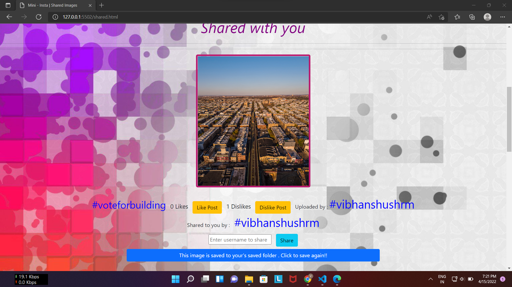
  
All the necessary detail are provided with  the image . 
  
<h2><u>Tech - stack used : </u> </h2>
<ul>
    <li>HTML</li>
    <li>CSS</li>
    <li>JAVASCRIPT ( IN THE BACKEND ALSO )</li>
    <li>FIREBASE AUTHENTICATION</li>
    <li>FIREBASE REALTIME DATABASE</li>
    <li>FIREBASE STORAGE</li>
</ul>

